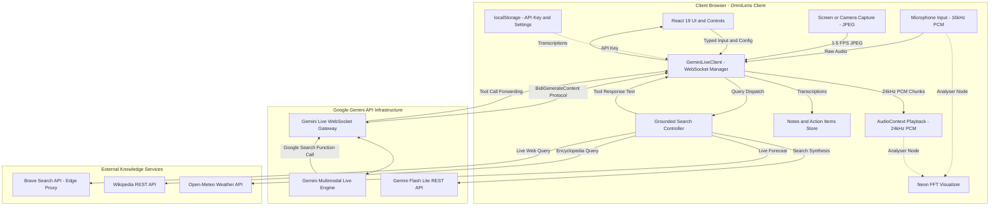
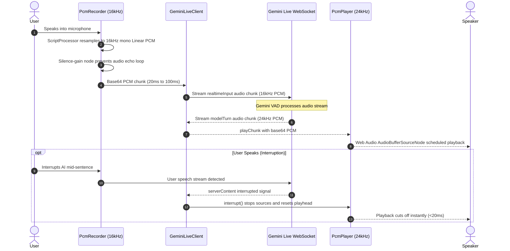
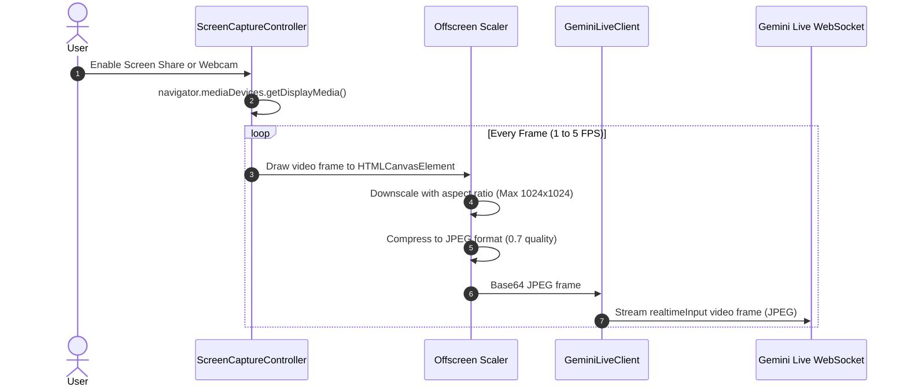
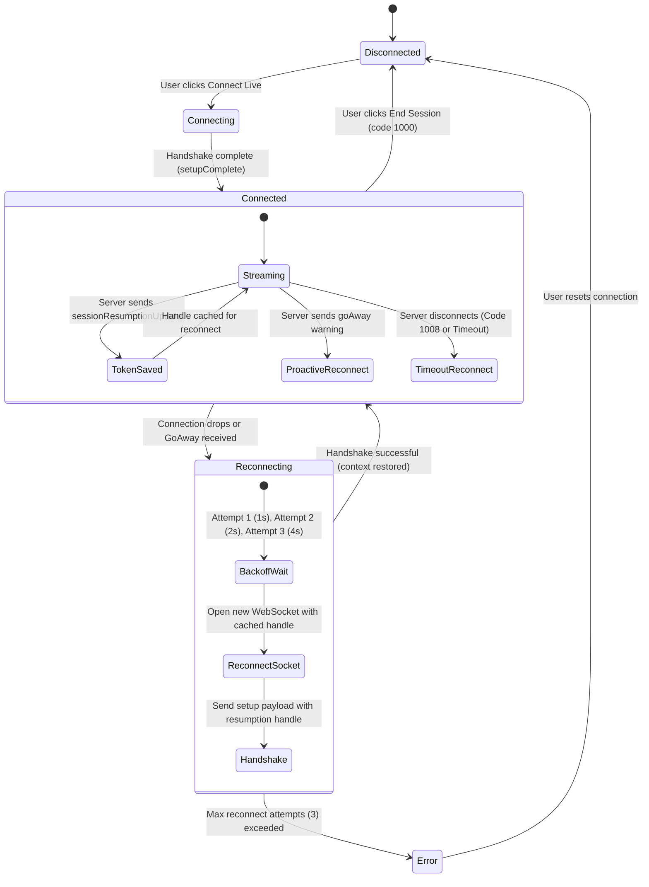

# 🎙️ OmniLens — Real-Time Multimodal Voice & Screen Copilot

[](https://react.dev/)
[](https://www.typescriptlang.org/)
[](https://vitejs.dev/)
[](https://tailwindcss.com/)
[](https://ai.google.dev/)
[](https://vitest.dev/)
[](https://opensource.org/licenses/MIT)

> **OmniLens** is a high-performance, ultra-low-latency, real-time multimodal copilot. It **hears your voice**, **speaks back with natural inflection**, and **"sees" your active screen or camera in real time** — powered directly by Google's bidirectional **Gemini Live API** (`BidiGenerateContent` WebSockets).

---

## 📑 Table of Contents

- [🌟 Key Capabilities](#-key-capabilities)
- [🏗️ System Architecture](#️-system-architecture)
  - [High-Level Topology](#high-level-topology)
  - [Audio Streaming Pipeline](#audio-streaming-pipeline)
  - [Vision Streaming Pipeline](#vision-streaming-pipeline)
  - [Session Lifecycle & Resumption Architecture](#session-lifecycle--resumption-architecture)
  - [Web Search Grounding Engine](#web-search-grounding-engine)
- [🎭 Copilot Personas](#-copilot-personas)
- [🗣️ Supported Models & Expressive Voices](#️-supported-models--expressive-voices)
- [🚀 Quick Start (Local Development)](#-quick-start-local-development)
  - [Prerequisites](#prerequisites)
  - [Installation & Launch](#installation--launch)
- [📖 User Guide](#-user-guide)
  - [1. Connecting & Configuring](#1-connecting--configuring)
  - [2. Screen & Camera Sharing](#2-screen--camera-sharing)
  - [3. Voice Conversations & Instant Interruption](#3-voice-conversations--instant-interruption)
  - [4. Real-Time Action Items & Notes](#4-real-time-action-items--notes)
  - [5. Typed Messages & Multimodal Chat](#5-typed-messages--multimodal-chat)
- [☁️ Production Deployment](#️-production-deployment)
  - [Deploying to Vercel (Recommended)](#deploying-to-vercel-recommended)
  - [Self-Hosting (Docker / Static Nginx)](#self-hosting-docker--static-nginx)
- [🔒 Security & Privacy](#-security--privacy)
- [🧪 Testing & Verification](#-testing--verification)
- [📂 Project Structure](#-project-structure)
- [❓ Troubleshooting & FAQ](#-troubleshooting--faq)
- [📄 License](#-license)

---

## 🌟 Key Capabilities

* 👁️ **"See What I See" Visual Perception**: Streams your active desktop display (VS Code, terminal, Figma, slides, browser) or mobile camera at a token-optimized 1–5 FPS with dynamic canvas scaling.
* 🎙️ **Zero-Latency Spoken Dialogue**: Captures raw 16kHz mono PCM microphone audio and plays back fluid 24kHz PCM synthesized speech via the Web Audio API.
* ⚡ **Natural Voice Interruption (Server VAD)**: Speak over Gemini at any point; the client instantly silences active playback, clears queued audio buffers, and allows the model to fluidly pivot to your new thought.
* 🔄 **Session Resumption & Unlimited Duration**: Automatically captures and tracks server-side resumption tokens (`sessionResumptionUpdate`) and leverages `contextWindowCompression` to bypass connection duration limits with seamless auto-reconnect.
* 🔍 **Smart Live Web Grounding**: Uses native Gemini function calling (`google_search`) combined with a **Static Knowledge Guard** (bypasses unnecessary searches for stable facts like historical dates or math constants) and free-tier REST synthesis (Gemini 3.1/3.5 Flash Lite + Brave Search + Wikipedia + Open-Meteo).
* 📝 **Real-Time Note & Action Item Extraction**: Intelligent heuristics automatically catch action items, key insights, and code snippets from conversation transcripts, exportable to Markdown or JSON.
* 🌊 **Dual-Channel Neon Visualizer**: Real-time canvas oscilloscope showing reactive glowing waveforms for both the user's mic input and Gemini's incoming voice.
* 🌐 **100% Client-Side Direct Architecture**: Connects directly from the user's browser to Google's edge WebSocket servers over TLS. No intermediary backend server introduces latency or proxy bottlenecks.

---

## 🏗️ System Architecture

### High-Level Topology



---

### Audio Streaming Pipeline



1. **Capture & Resampling**: Microphone input is captured via `navigator.mediaDevices.getUserMedia`. A Web Audio `ScriptProcessorNode` / `AudioContext` resamples any native hardware frequency (e.g. 44.1kHz or 48kHz) down to **16,000 Hz, 16-bit linear PCM**.
2. **Echo Suppression**: A dedicated zero-gain `GainNode` isolates the recorder stream from `audioContext.destination`, ensuring microphone input never bleeds into user speakers.
3. **VAD Signaling**: When the user mutes their mic or stops audio, `sendAudioStreamEnd()` sends `realtimeInput.audioStreamEnd = true` to inform the server-side Voice Activity Detection engine.
4. **Jitter-Free Playback**: Incoming 24kHz PCM chunks are scheduled sequentially on the `AudioContext.currentTime` timeline. If active sources deplete, `resetPlayhead()` re-synchronizes the playhead to eliminate drift over long multi-turn sessions.

---

### Vision Streaming Pipeline



- **Adaptive Resolution Scaling**: Screen feeds are constrained to a bounding box (default: 1024×1024 max dimensions, 768px for standard mobile) to maintain code legibility while keeping token consumption economical.
- **Hardware-Aware Fallback**: If `getDisplayMedia` is not supported (such as on mobile Android/iOS browsers), OmniLens detects the environment and gracefully falls back to the device's camera via `getUserMedia({ video: { facingMode: 'environment' } })`.

---

### Session Lifecycle & Resumption Architecture

Google's Gemini Live API imposes a connection lifetime limit of approximately **10 minutes per WebSocket connection**. OmniLens implements the official **Session Resumption** protocol to enable seamless, continuous, multi-hour sessions without context loss.



- **Resumption Token Caching**: Whenever Gemini emits a `sessionResumptionUpdate` containing a `newHandle`, OmniLens stores it in memory (valid for up to 2 hours).
- **Proactive Handover**: If Gemini sends a `goAway` frame warning that the connection is expiring, OmniLens initiates a graceful reconnection before the socket drops.
- **Accurate Error Parsing**: WebSocket close code `1008` (Policy Violation) is checked against explicit reason strings. Only explicit auth failures trigger an API Key error banner; normal connection timeouts trigger automatic reconnection with exponential backoff.

---

### Web Search Grounding Engine

OmniLens features an intelligent, multi-tiered search architecture:

1. **Static Knowledge Guard**: Evaluates incoming queries with high-precision heuristics (`isObviouslyStaticQuery`). Queries with immutable answers (e.g., *"Who was the first president of the USA"*, *"Speed of light"*, *"Capital of France"*) bypass external web scraping and are synthesized instantly via Gemini Flash Lite in under ~300ms.
2. **Dynamic Live Web Grounding**: When time-sensitive information is requested (current news, live scores, weather, recent events), OmniLens orchestrates:
   - **Brave Search API**: Live web indexing (via CORS-safe `/api/brave` Vercel Edge proxy).
   - **Wikipedia REST API**: Structured encyclopedia overviews.
   - **Open-Meteo API**: Real-time global weather and forecasts without requiring an API key.
   - **Gemini Flash Lite Synthesis**: Consolidates search snippets into a concise, grounded factual summary returned directly to the Live session as a `toolResponse`.

---

## 🎭 Copilot Personas

OmniLens includes 8 tuned system personas accessible via the floating persona bar:

| Persona | Icon | Specialization & Visual Context |
|---|:---:|---|
| **Pair Programmer** | `>_` | Inspects IDE code, terminals, compiler errors, stack traces, and architectural refactoring. Proactively flags bugs and security vulnerabilities. |
| **System Design** | `🏛️` | Evaluates cloud architecture diagrams, distributed databases, CAP theorem trade-offs, caching tiers, bottlenecks, and failure modes. |
| **Meeting Copilot** | `👥` | Real-time meeting note-taker, slide reviewer, executive summary generator, and action-item extractor. |
| **Study Tutor** | `🎓` | Socratic learning coach for homework, textbook diagrams, math equations, scientific concepts, and step-by-step problem walkthroughs. |
| **Legal & Compliance** | `🛡️` | Reviews terms of service, contracts, indemnification clauses, licensing agreements, and compliance obligations on screen. |
| **Language Tutor** | `🌐` | Foreign language immersion coach providing conversational practice, grammar feedback, and real-time screen translation. |
| **Financial Analyst** | `📈` | Analyzes corporate 10-K/10-Q filings, balance sheets, financial charts, valuation multiples, and macroeconomic data. |
| **General Assistant** | `🤖` | All-around multimodal conversational companion for everyday visual and spoken queries. |

---

## 🗣️ Supported Models & Expressive Voices

### Gemini Live Models

* **`gemini-3.1-flash-live-preview`** *(Default)*: Flagship ultra-low latency audio/vision bidirectional streaming model with minimal thinking overhead.
* **`gemini-3.8-live`**: Balanced conversational model with medium internal reasoning depth.
* **`gemini-3.8-live-extended-thinking`**: High reasoning depth model suited for intricate debugging and advanced system architecture.
* **`gemini-3.5-live-translate-preview`**: Dedicated low-latency bidirectional speech translation model with target language echoing.
* **`gemini-3.5-transcribe-live`**: High-accuracy real-time speech transcription engine (text modality output).

### 10 Expressive Prebuilt Voices

OmniLens supports all official Google Gemini voices, complete with an **in-browser audio audition feature** in Settings:

| Voice Name | Tone / Style | Voice Name | Tone / Style |
|---|---|---|---|
| **Aoede** *(Default)* | Warm, clear, balanced | **Despina** | Smooth, thoughtful, calm |
| **Kore** | Bright, upbeat, energetic | **Puck** | Playful, quick, friendly |
| **Leda** | Professional, authoritative | **Charon** | Deep, resonant, serious |
| **Callirrhoe** | Soft, conversational, gentle | **Fenrir** | Crisp, sharp, assertive |
| **Autonoe** | Dynamic, expressive, articulate | **Zephyr** | Breezy, modern, relaxed |

---

## 🚀 Quick Start (Local Development)

### Prerequisites

* **Node.js**: v18.0.0 or higher (v20+ recommended)
* **npm** or **pnpm** / **yarn**
* **Modern Web Browser**: Google Chrome, Microsoft Edge, Brave, or Safari with Web Audio API support.
* **Google Gemini API Key**: Free tier or paid API key from [Google AI Studio](https://aistudio.google.com/app/apikey).
* *(Optional)* **Brave Search API Key**: For web search grounding (free 2,000 queries/month at [brave.com/search/api](https://brave.com/search/api/)).

### Installation & Launch

1. **Clone the repository**:
   ```bash
   git clone https://github.com/jasontan89/omnilens.git
   cd omnilens
   ```

2. **Install dependencies**:
   ```bash
   npm install
   ```

3. **Start the local development server**:
   ```bash
   npm run dev
   ```

4. **Open your browser**:
   Navigate to [http://localhost:5173](http://localhost:5173).

---

## 📖 User Guide

### 1. Connecting & Configuring
1. Click the **Settings** (⚙️) icon in the top header.
2. Paste your **Google Gemini API Key**.
3. *(Optional)* Select your preferred **Copilot Persona**, **Gemini Model**, and **Voice** (click the speaker icon to audition voices).
4. *(Optional)* Toggle **Real-Time Web Search Grounding** and supply a Brave Search key if desired.
5. Click **Save Settings**.
6. In the bottom floating control dock, click **Connect Live**. Grant microphone permission when prompted.

### 2. Screen & Camera Sharing
* **Desktop**: Click the **Screen Share** (🖥️) button in the floating dock. Select an application window (e.g., VS Code), browser tab, or entire display. OmniLens will stream video frames to Gemini.
* **Mobile**: If screen sharing is unsupported on mobile browsers, click the **Camera** (📷) button to activate your rear or front camera for real-world inspection.

### 3. Voice Conversations & Instant Interruption
* Simply speak into your microphone. Gemini will stream voice responses back through your speakers.
* The **Neon Audio Visualizer** displays your speech in cyan/purple and Gemini's speech in magenta/emerald.
* If Gemini is speaking and you wish to change topic or clarify, **just start talking**. Gemini will halt playback immediately and address your new question.

### 4. Real-Time Action Items & Notes
* OmniLens listens for actionable commitments, instructions, or code generated during your conversation.
* View captured takeaways in the **Action Items & Notes** panel.
* Add your own notes manually with the **+ Add** button or export the entire session to a Markdown/JSON file using the download icon.

### 5. Typed Messages & Multimodal Chat
* Prefer typing? Use the chat bar in the **Live Transcript** panel to send typed prompts.
* Typed messages adhere to the official Gemini `clientContent` protocol with `turnComplete: true`, ensuring flawless synchronization with audio and visual inputs.

---

## ☁️ Production Deployment

### Deploying to Vercel (Recommended)

OmniLens is designed for effortless 1-click deployment on [Vercel](https://vercel.com):

1. Push your repository to GitHub.
2. In Vercel, click **"Add New Project"** and import `omnilens`.
3. Vercel automatically detects the Vite framework:
   - **Build Command**: `npm run build`
   - **Output Directory**: `dist`
4. Click **Deploy**.

> **Edge Proxy Included:** The repository includes [`api/brave.ts`](./api/brave.ts) and [`vercel.json`](./vercel.json). On Vercel, requests to `/api/brave` execute on the Vercel Edge Network to cleanly proxy Brave Search requests without browser CORS restrictions.

### Self-Hosting (Docker / Static Nginx)

OmniLens can be compiled into static HTML/JS/CSS assets:

```bash
# Build production bundle
npm run build

# Preview production build locally
npm run preview
```

Serve the contents of the `dist/` directory with any static file server (Nginx, Caddy, Cloudflare Pages, AWS S3 + CloudFront, or GitHub Pages).

---

## 🔒 Security & Privacy

* **Zero Server-Side Key Storage**: Your Google Gemini API Key and Brave Search API Key are stored **strictly in your browser's `localStorage`**. They are never logged, forwarded, or stored on any intermediate server.
* **Direct Client-to-Edge Encryption**: All voice, video, and text packets travel directly over secure WebSockets (`wss://generativelanguage.googleapis.com`) using TLS encryption.
* **Open Source & Auditable**: No obfuscated tracking, analytics, or third-party telemetry scripts.

---

## 🧪 Testing & Verification

OmniLens maintains strict test coverage using [Vitest](https://vitest.dev/):

```bash
# Run the complete test suite
npm test

# Run tests in watch mode
npx vitest

# Run TypeScript typecheck without emitting code
npx tsc --noEmit

# Run fast code linter (oxlint)
npm run lint
```

### Test Suite Highlights (74 Tests Passing)
- **Protocol Compliance**: Validates Gemini Live API `BidiContentSetup`, `realtimeInput.audio`, `realtimeInput.video`, and `clientContent`.
- **Session Resumption & Timeout**: Simulates server `goAway` frames, close code `1008`, handle caching, and exponential backoff reconnection.
- **Static Knowledge Guard**: Rigorously tests 29+ static vs. time-sensitive query patterns.
- **Audio & Video Math**: Verifies aspect-ratio scaling, 16kHz audio buffer downsampling, and screen capture constraints.

---

## 📂 Project Structure

```
omnilens/
├── api/
│   └── brave.ts              # Vercel Edge function proxy for Brave Search API (CORS bypass)
├── public/                   # Static assets, SVG icons, and web manifest
├── src/
│   ├── components/           # React UI components
│   │   ├── ControlBar.tsx    # Floating dock (Connect, Mic, Camera, Screen, Mute)
│   │   ├── Header.tsx        # Top status bar, live badge, and persona quick-selector
│   │   ├── NotesPanel.tsx    # Action items & notes manager with Markdown export
│   │   ├── ScreenPreview.tsx # Live canvas/video viewport for screen and camera
│   │   ├── SettingsModal.tsx # Full settings configuration & voice auditioning
│   │   ├── TranscriptView.tsx# Live chat transcript with search source badges
│   │   └── Visualizer.tsx    # Dual-channel neon audio waveform visualizer
│   ├── lib/
│   │   ├── audio/            # Web Audio API architecture
│   │   │   ├── pcm-player.ts # 24kHz raw PCM scheduler with drift compensation
│   │   │   ├── pcm-recorder.ts# 16kHz PCM microphone capture & echo suppression
│   │   │   └── voice-preview.ts# REST-based voice audition synthesis
│   │   ├── gemini/           # Gemini Live API client & search grounding
│   │   │   ├── live-client.ts# WebSocket client (Setup, Resumption, VAD, Auto-Reconnect)
│   │   │   ├── prompts.ts    # Tuned system instructions for the 8 personas
│   │   │   └── search-grounding.ts# Multi-engine search grounding (Flash Lite, Brave, Wiki)
│   │   └── video/            # Video & display capture
│   │       └── screen-capture.ts# Screen & webcam capture with token-efficient downscaling
│   ├── types/
│   │   └── live.ts           # TypeScript interfaces for the Gemini Live WebSocket protocol
│   ├── App.tsx               # Primary application state coordinator
│   └── main.tsx              # React DOM root entry point
├── vercel.json               # Vercel deployment configuration & edge rewrites
├── package.json              # Project dependencies & scripts
├── tsconfig.json             # TypeScript configuration
└── vite.config.ts            # Vite bundler configuration
```

---

## ❓ Troubleshooting & FAQ

<details>
<summary><b>Q: I see "Invalid API key or unauthorized access". What should I do?</b></summary>

1. Ensure your Gemini API Key was generated in [Google AI Studio](https://aistudio.google.com/app/apikey).
2. Ensure your key has access to Gemini 3.1 Flash / Live models.
3. If this error appeared after ~10 minutes of active use on an older version, update to the latest version of OmniLens. Version `da53865` or later includes automatic **Session Resumption** to transparently reconnect across connection limits.
</details>

<details>
<summary><b>Q: Can I share my screen on an iPhone or Android device?</b></summary>

Most mobile browsers (iOS Safari, mobile Chrome) restrict the `getDisplayMedia` screen capture API due to operating system sandboxing. OmniLens automatically detects this and offers a one-tap **Camera** mode, allowing you to point your phone at your monitor, textbook, or surroundings.
</details>

<details>
<summary><b>Q: How much does running OmniLens cost on the Gemini API?</b></summary>

Google Gemini offers a generous **Free Tier** in Google AI Studio. Because OmniLens routes all search grounding calls to `gemini-3.1-flash-lite` and employs `contextWindowCompression: { slidingWindow: {} }`, token accumulation is aggressively pruned, allowing extensive testing on free tier quotas.
</details>

<details>
<summary><b>Q: Why does Gemini occasionally answer general knowledge questions without searching?</b></summary>

This is by design! OmniLens incorporates a **Static Knowledge Guard** that trains the model to answer stable knowledge (e.g. historical facts, math proofs, programming definitions) directly from its neural weights. Web searches are reserved for real-time and rapidly changing information (news, weather, stock prices, live scores), preserving your search quota and eliminating response latency.
</details>

---

## 📄 License

This project is licensed under the [MIT License](LICENSE). Feel free to use, modify, and distribute it for personal or commercial projects.

---

<p align="center">
  Built with ❤️ for the next generation of real-time multimodal AI copilots.
</p>
